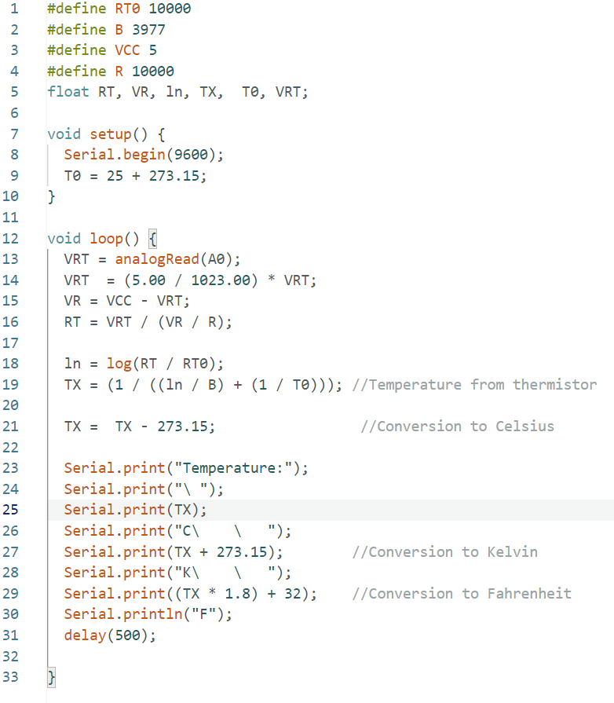
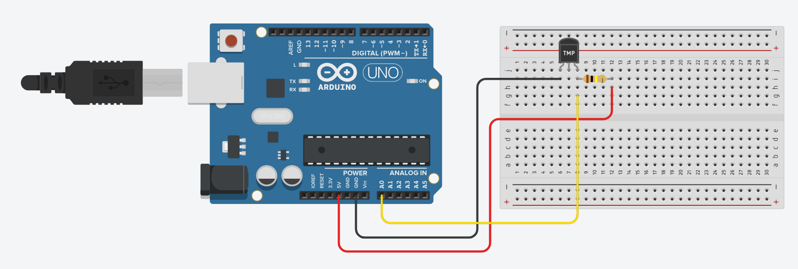

## How to Setup
1. Create a Virtual Enviornment 
    `python -m venv <environment_name>`
    * Example: `python -m venv gui_env`

2. Activate the virtual environment
    * MacOS/Linux: `source <environment_name>/bin/activate`
        * Example: `source gui_env/bin/activate`
    * Windows: `<environment_name>\Scripts\activate`
        * Example: `gui_env\Scripts\activate`

3. Install the required dependencies: `python -m pip install -r requirements.txt

4. Run the GUI: `python main.py`

## The Project

This project created a GUI to plot live data from two sensors, an ultrasonic sensor and a thermistor.

1. Thermistor

The thermistor schematic and arduino code used to plot the data are linked below

2. Ultrasonic Sensor

The ultrasonic schematic and arduino code used to plot the data are linked below

